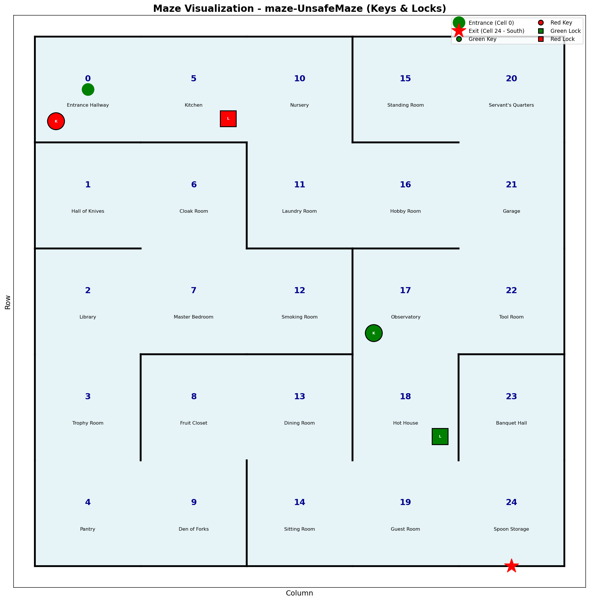
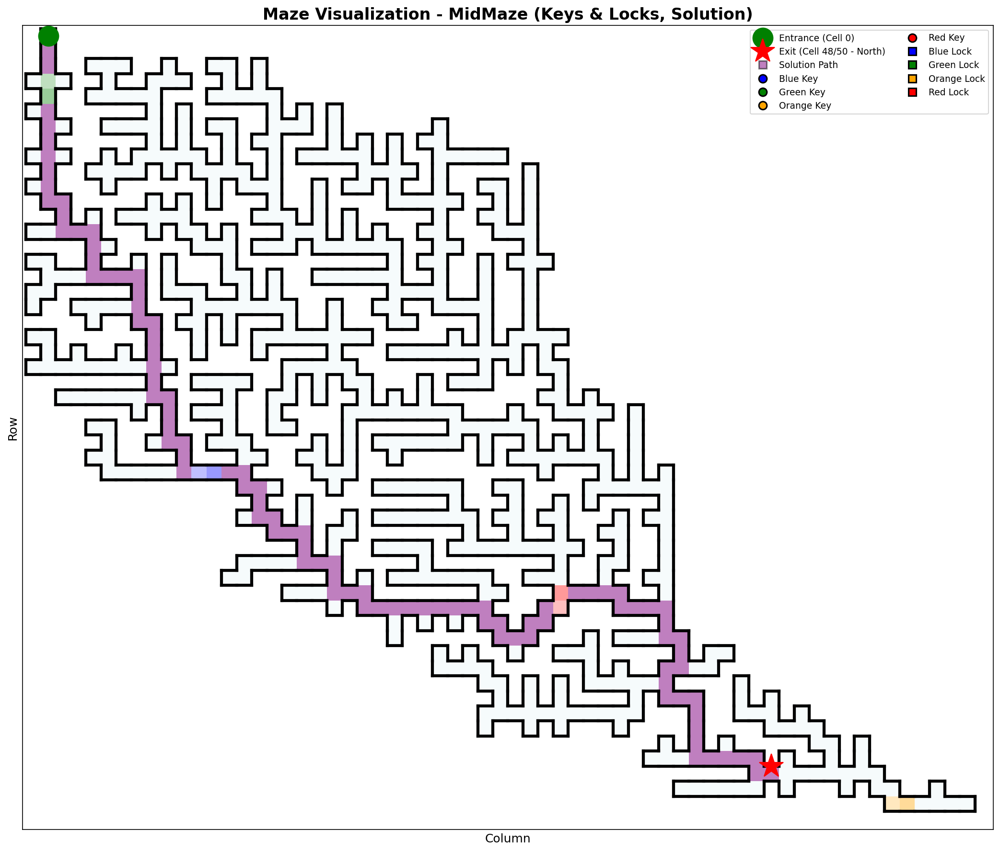

# Linked Data MASE - A Maze-Based Multi-Agent Systems Environment for Testing and Visualizing Hypermedia Agents

Run [MASE server](mase-server/README.md) and [MASE viewer](mase-viewer/README.md) together with Docker Compose to run simulations of interactive maze scenarios accessible to agents via HTTP GET and POST and get a corresponding front end for visualization purpose.

## Prerequisites
- Docker Desktop (or Docker Engine with Compose)

## Quick Start
```powershell
docker compose up --build
```

- Server (entry point): http://127.0.1.1:8080/maze
- Viewer: http://127.0.1.1:3000/ or http://localhost:3000

## Start & Choose a maze scenario
Default scenario is `sim-SmallMaze`.

```powershell
$env:TASKNAME="sim-MidMaze"
docker compose up --build
```

For each scenario, a `.properties` file is available (e.g., [sim-SmallMaze.properties](mase-server/sim-SmallMaze.properties)) that defines the maze dataset and the execution order in which the rules (SPARQL Queries, see below) are applied. 

- Scenario properties are the only supported place for server runtime settings that belong to a simulation run.
- Rules may be applicable to every maze or only to a specific maze scenario (e.g., `SmallMaze`).
- Rules that apply to a specific maze scenario are always activated (e.g., the unlocking mechanism), while globally applicable rules are optional (e.g., `Stigmergy`).
- To define which rules that are globally applicable should be activated, pass their names as a second value in `TASKNAME` (e.g., `sim-SmallMaze Stigmergy` to apply the `Stigmergy` ruleset to the `sim-SmallMaze` scenario).
- Transaction trace broadcasting is configured in the selected scenario file with `mase.transaction.trace`. Shipped scenarios use `summary`, which emits lightweight transaction headers without per-triple logging.

### Transaction Trace Modes

`mase.transaction.trace` supports three modes:

- `off`: no `TRANSACTION` debug events are broadcast.
- `summary`: broadcast committed/rolled-back transaction headers with time, trigger, agent, graph, status, error, and number of executed rules. This is the default middle ground for multi-agent runs.
- `full`: additionally include request bodies, merge triples, and per-rule RDF diffs. Use this for debugging only because it snapshots repository state around rule execution.

The maze dataset is an RDF file that defines the maze structure and the initial state of the environment.

## Start & Choose a maze scenario + rules
Pass both values in `TASKNAME` (equivalent to Gradle `--args="sim-SmallMaze Stigmergy"`).

```powershell
$env:TASKNAME="sim-SmallMaze Stigmergy"
docker compose up --build
```

Rules are SPARQL Queries that are executed after initilaization and during the processing of each HTTP GET and POST request to the MASE-server by an agent. This can be used to customize the environment and to evolve it in response to the effects of agents' operations. For example, the `Stigmergy` ruleset adds stigmergic markers to the maze cells counting the traffic of agents. The ruleset is applied to the `sim-SmallMaze` scenario in the example above, but it can be applied to any maze scenario by passing `Stigmergy` as a second value in `TASKNAME`.

Rules are defined in `mase-server/src/main/resources/rules/` and are either globally applicable (e.g., `Stigmergy`) or only to a specific maze scenario (e.g., `SmallMaze`).

## Navigating MASE

MASE navigation is controlled by HTTP semantics plus RDF validation logic.

- **Authorization header activates access control:** send `Authorization: <agentName>` (or `Authorization: Agent <agentName>`) so requests are validated against the agent’s current maze location.
- **No header = unrestricted access (debug mode):** if no `Authorization` header is provided, all resources remain accessible to support runtime debugging and inspection.
- **First entry rule:** an agent without a known location must enter by POSTing to the maze entrance cell (the `xhv:start` target) with exactly one `dynmaze:entersFrom` triple that points to `/maze`.
- **Adjacency constraints for movement:** movement POSTs are detected by `dynmaze:entersFrom`; MASE enforces exactly one source cell, requires that source to match the agent’s actual current cell, and allows movement only when an RDF edge (`maze:north|south|east|west|exit`) exists from source to target.
- **Local perception and action:** authenticated agents can only `GET` and non-movement `POST` on their current cell.
- **Agent named graph creation:** on first valid maze entry, MASE creates a named graph for the agent IRI and inserts an `a maze:Agent` triple.
- **Transactional request pipeline:** MASE parses RDF payloads, then validates access, merges triples, executes rules, and checks core movement postconditions inside one repository transaction.
- **Scoped concurrency:** POST handling serializes requests that affect the same target graph, movement source graph, or agent identity. Independent graphs can proceed concurrently where their core request scopes do not overlap.
- **Scenario-specific behavior stays in rules:** Java enforces embodiment, adjacent movement requests, and local-only interaction. Unlocking, switches, UI materialization, and other scenario effects are encoded in SPARQL rules.

### Example Request Flow

1. Agent `bob` sends `GET: http://127.0.1.1:8080/maze` with header `Authorization: bob` to discover the maze entrance cell (e.g., `/cells/0/0`).

2. Bob sends `POST: http://127.0.1.1:8080/cells/0/0` with header `Authorization: bob` and body `<http://127.0.1.1:8080/agents/bob> <https://paul.ti.rw.fau.de/~am52etar/dynmaze/dynmaze#entersFrom> <http://127.0.1.1:8080/maze> .` to enter the maze. The global movement rules materialize the movement by adding a containment triple for the agent in the target cell’s graph and removing any previous containment triple. See [move_start.rq](mase-server/src/main/resources/rules/Global/move_start.rq) and [move.rq](mase-server/src/main/resources/rules/Global/move.rq) for details.

3. Bob is now allowed to `GET` and `POST` on `/cells/0/0`. Remember that Bob can only perceive the current cell and can only request a move to an adjacent cell. If Bob tries to move to a non-adjacent cell or tries to `GET` or `POST` on a different cell, the request will be rejected by the server.

4. If the current cell is locked and Bob has previously observed a key of the required type, it can `POST` to that current cell a triple like `<http://127.0.1.1:8080/cells/0/1> <https://paul.ti.rw.fau.de/~am52etar/dynmaze/dynmaze#keyValue> "redkey" .` to unlock it. Non-movement POSTs are local interactions and are rejected if sent to a cell other than the agent's current cell. The ruleset materializing the unlocking is defined in the maze-specific rules file (e.g., [unlock-redkey.rq](mase-server/src/main/resources/rules/SmallMaze/unlock-redkey.rq)).

5. Consider the maze solved when Bob moved to the exit cell (`/cells/999`) via the `maze:exit` edge.

## Example Agent

Run sample dfs agent (name: `bob`) against a running server:
```shell script
gradle runBobAgent
```

Run the same agent with Docker (server must already be running):
```powershell
docker compose exec mase-server sh -lc "java -cp '/opt/mase/install/mase-server/lib/*' org.maze.examples.SampleDfsAgentBob"
```

The sample agent always sends `Authorization: bob`, starts with `GET /maze`, enters the discovered start cell with `dyn:entersFrom`, then navigates in depth-first-search ordered by `west, north, east, south`. If the current cell is locked and `dyn:needsAction` requires a key type that was previously observed via `GET`, it posts `dyn:keyValue` to unlock and re-checks the cell. It finishes when it reaches `/cells/999` via `maze:exit`.

Detailed example-agent documentation: [mase-server/src/main/java/org/maze/examples/README.md](mase-server/src/main/java/org/maze/examples/README.md)

## Overview of the MASE scenarios

### SmallMaze



### MidMaze



### BigMaze


---
# Further References and Related Projects

- https://github.com/wintechis/agents-llm-affordances

```bibtex
@inproceedings{schmid_2025,
    address = {Cham},
    title = {Adaptive {Planning} on the {Web}: {Using} {LLMs} and {Affordances} for {Web} {Agents}},
    isbn = {978-3-031-81221-7},
    shorttitle = {Adaptive {Planning} on the {Web}},
    doi = {10.1007/978-3-031-81221-7_7},
    abstract = {We investigate the adaption of agents using plans on the Web despite its large and dynamic nature, as well as agents’ constrained perception. Based on Semantic Web technologies and affordances, we compare how agents choose appropriate actions to adapt to their environment by condition-action rules or suggested actions of large language models. We conduct experiments on execution cost and plan stability distance to see whether agents choose appropriate actions to adapt their plans. We find that cost and stability of rule-based and LLMs for adaptation with affordances are close together, while performance differs greatly.},
    language = {en},
    booktitle = {Knowledge {Graphs} and {Semantic} {Web}},
    publisher = {Springer Nature Switzerland},
    author = {Schmid, Sebastian and Freund, Michael and Harth, Andreas},
    editor = {Tiwari, Sanju and Villazón-Terrazas, Boris and Ortiz-Rodríguez, Fernando and Sahri, Soror},
    year = {2025},
    keywords = {Adaption, Dynamic Environments, Web Agents},
    pages = {93--108},
}
```

In particular the datasets ([SmallMase](mase-server/data/SmallMaze.trig), [MidMaze](mase-server/data/MidMaze.trig), [BigMaze](mase-server/data/BigMaze.trig)) and key-lock mechanism (e.g., [unlock-redkey.rq](mase-server/src/main/resources/rules/SmallMaze/unlock-redkey.rq)).

---
- https://github.com/bold-benchmark/bold-server

```bibtex
@misc{kafer_2023,
    title = {{BOLD}: {A} {Benchmark} for {Linked} {Data} {User} {Agents} and a {Simulation} {Framework} for {Dynamic} {Linked} {Data} {Environments}},
    shorttitle = {{BOLD}},
    url = {http://arxiv.org/abs/2307.09114},
    doi = {10.48550/arXiv.2307.09114},
    abstract = {The paper presents the BOLD (Buildings on Linked Data) benchmark for Linked Data agents, next to the framework to simulate dynamic Linked Data environments, using which we built BOLD. The BOLD benchmark instantiates the BOLD framework by providing a read-write Linked Data interface to a smart building with simulated time, occupancy movement and sensors and actuators around lighting. On the Linked Data representation of this environment, agents carry out several specified tasks, such as controlling illumination. The simulation environment provides means to check for the correct execution of the tasks and to measure the performance of agents. We conduct measurements on Linked Data agents based on condition-action rules.},
    urldate = {2025-09-24},
    publisher = {arXiv},
    author = {Käfer, Tobias and Charpenay, Victor and Harth, Andreas},
    month = jul,
    year = {2023},
    note = {arXiv:2307.09114 [eess]},
    keywords = {Computer Science - Artificial Intelligence, Computer Science - Systems and Control, Electrical Engineering and Systems Science - Systems and Control},
}
```

In particular as a reference for [Configurator.java](mase-server/src/main/java/org/maze/Configurator.java) with `.properties` files (e.g., [sim-SmallMaze.properties](mase-server/sim-SmallMaze.properties)) and [LinkedDataDereferenceResource.java](mase-server/src/main/java/org/maze/api/ld/LinkedDataDereferenceResource.java)

---
- https://github.com/amee-project/maze-server
